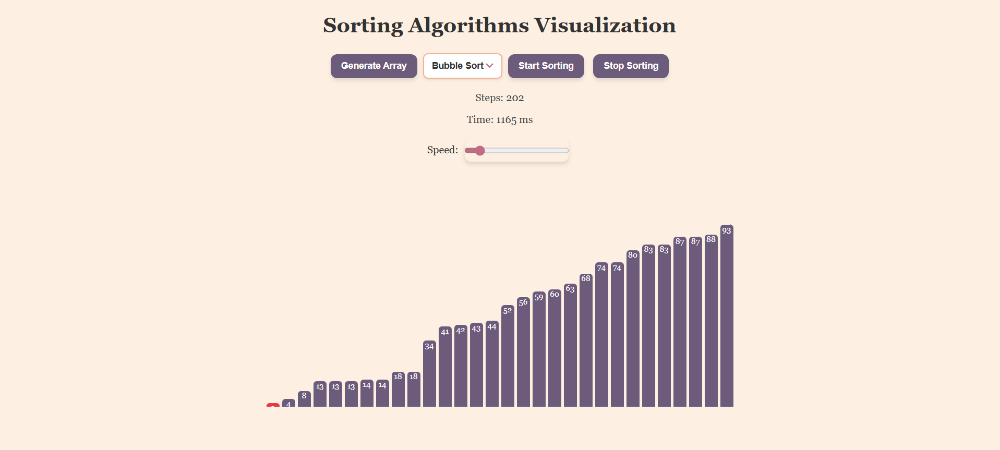

# Sorting Algorithms Visualization

A beautiful and interactive web application that visualizes various sorting algorithms in real-time. Watch as different sorting algorithms work their magic on randomly generated arrays with step-by-step animations.



## 🌟 Features

- **9 Sorting Algorithms**: Visualize Bubble Sort, Selection Sort, Insertion Sort, Quick Sort, Merge Sort, Heap Sort, Shell Sort, Radix Sort, and Counting Sort
- **Real-time Visualization**: Watch each step of the sorting process with smooth animations
- **Interactive Controls**: Generate new arrays, select algorithms, control speed, and stop/start sorting
- **Performance Metrics**: Track the number of steps and execution time for each algorithm
- **Responsive Design**: Works seamlessly on desktop and mobile devices
- **Beautiful UI**: Modern, clean interface with smooth transitions and hover effects

## 🚀 Live Demo

Open `index.html` in your web browser to start visualizing sorting algorithms!

## 📋 Supported Algorithms

| Algorithm | Time Complexity | Space Complexity | Description |
|-----------|----------------|------------------|-------------|
| **Bubble Sort** | O(n²) | O(1) | Simple comparison-based algorithm that repeatedly steps through the list |
| **Selection Sort** | O(n²) | O(1) | Divides the input into a sorted and unsorted region |
| **Insertion Sort** | O(n²) | O(1) | Builds the final sorted array one item at a time |
| **Quick Sort** | O(n log n) | O(log n) | Divide-and-conquer algorithm using a pivot element |
| **Merge Sort** | O(n log n) | O(n) | Divide-and-conquer algorithm that recursively sorts subarrays |
| **Heap Sort** | O(n log n) | O(1) | Comparison-based sorting using binary heap data structure |
| **Shell Sort** | O(n log n) | O(1) | Generalization of insertion sort with diminishing increments |
| **Radix Sort** | O(nk) | O(n+k) | Non-comparative integer sorting algorithm |
| **Counting Sort** | O(n+k) | O(k) | Non-comparative sorting algorithm for integers |

## 🛠️ Technologies Used

- **HTML5**: Structure and semantic markup
- **CSS3**: Styling, animations, and responsive design
- **JavaScript (ES6+)**: Core functionality and algorithm implementations
- **ES6 Modules**: Modular code organization

## 📁 Project Structure

```
Sorting_Visualization/
├── index.html              # Main HTML file
├── style.css               # Styles and animations
├── script.js               # Main JavaScript logic
├── Sorting_Algo/           # Algorithm implementations
│   ├── bubble.js
│   ├── selection.js
│   ├── insertion.js
│   ├── quick.js
│   ├── merge.js
│   ├── heap.js
│   ├── shell.js
│   ├── radix.js
│   └── counting.js
├── img/                    # Images and assets
│   └── demo.png
└── README.md               # This file
```

## 🎮 How to Use

1. **Open the Application**: Open `index.html` in your web browser
2. **Generate Array**: Click "Generate Array" to create a new random array
3. **Select Algorithm**: Choose your preferred sorting algorithm from the dropdown
4. **Adjust Speed**: Use the speed slider to control animation speed
5. **Start Sorting**: Click "Start Sorting" to begin the visualization
6. **Monitor Progress**: Watch the step counter and execution time
7. **Stop Anytime**: Use "Stop Sorting" to halt the current process

## 🎨 Visual Elements

- **Bars**: Each array element is represented as a colored bar
- **Height**: Bar height corresponds to the element's value
- **Colors**: 
  - Purple: Unsorted elements
  - Red: Currently being compared/swapped
  - Dark Red: Sorted elements

## 🔧 Customization

You can easily customize the application by:

- **Array Size**: Modify the `size` parameter in `generateArray()` function
- **Animation Speed**: Adjust the speed range in the HTML slider
- **Colors**: Update CSS variables for different color schemes
- **Bar Width**: Modify the `.bar` width property in CSS

## 📱 Browser Compatibility

- Chrome (recommended)
- Firefox
- Safari
- Edge
- Mobile browsers

## 🤝 Contributing

Contributions are welcome! Feel free to:

- Add new sorting algorithms
- Improve the UI/UX
- Optimize performance
- Add new features
- Fix bugs

## 📄 License

This project is open source and available under the [MIT License](LICENSE).

## 🙏 Acknowledgments

- Inspired by various sorting visualizers across the web
- Built for educational purposes to help understand sorting algorithms
- Special thanks to the JavaScript community for ES6 modules support

---

**Happy Sorting! 🎯**
